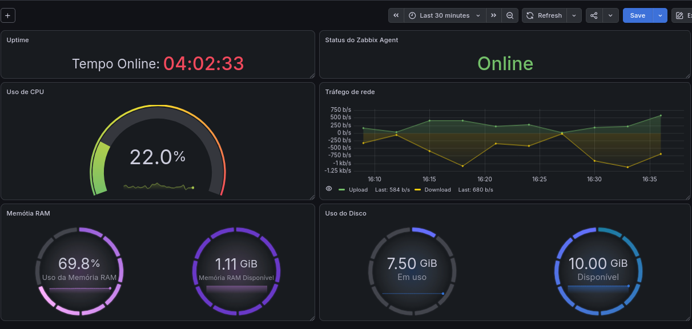

# Laboratório de Monitoramento com Zabbix e Grafana

## Sobre o projeto

Este projeto apresenta a criação de um laboratório de monitoramento utilizando Zabbix 7.4 e Grafana em um servidor Debian GNU/Linux 13 (Trixie).

O objetivo foi instalar e configurar uma solução de monitoramento para acompanhar as métricas do próprio servidor Linux, utilizando Zabbix Server, Zabbix Agent, MariaDB e Grafana.

Todo o ambiente foi montado em uma máquina virtual Debian 13, desde a preparação do sistema até a criação do dashboard de monitoramento.

---

## Objetivos

- Instalar e configurar o Zabbix Server;
- Configurar o banco de dados MariaDB;
- Instalar e configurar o Zabbix Agent;
- Disponibilizar o Frontend Web do Zabbix utilizando Apache2 e PHP;
- Integrar o Zabbix ao Grafana;
- Criar dashboards para acompanhamento das métricas do servidor;
- Documentar as etapas realizadas durante a implantação.

---

## Ambiente utilizado

| Componente | Versão |
|---|---|
| Sistema Operacional | Debian GNU/Linux 13 (Trixie) |
| Monitoramento | Zabbix Server 7.4 |
| Agente | Zabbix Agent |
| Banco de Dados | MariaDB |
| Servidor Web | Apache2 |
| Linguagem | PHP |
| Dashboard | Grafana |

---

## Host monitorado

Neste laboratório foi utilizado apenas um host:

| Host | Descrição |
|---|---|
| VM_Debian13 | Máquina virtual Debian 13 executando todos os serviços do laboratório |

---

## Arquitetura do laboratório

```
                 +----------------------+
                 |    Debian 13 VM      |
                 |    VM_Debian13       |
                 +----------+-----------+
                            |
                     Zabbix Agent
                            |
                     Zabbix Server
                            |
                        MariaDB
                            |
                    Apache2 + PHP
                            |
                  Frontend Web Zabbix
                            |
                  Plugin Zabbix Grafana
                            |
                         Grafana
                            |
                       Dashboard
```

Todos os serviços foram instalados na mesma máquina virtual.

O Zabbix Agent realiza a coleta das informações do sistema, o Zabbix Server processa e armazena os dados no MariaDB, e o Grafana utiliza essas informações para apresentar os dashboards.

---

## Documentação

As etapas de instalação e configuração estão documentadas nos arquivos abaixo:

- [01 - Atualização do Debian](docs/01-atualizacao-do-debian.md)
- [02 - Instalação do MariaDB](docs/02-instalacao-do-mariadb.md)
- [03 - Instalação do Zabbix](docs/03-instalacao-do-zabbix.md)
- [04 - Configuração do Zabbix](docs/04-configuracao-do-zabbix.md)
- [05 - Instalação do Grafana](docs/05-instalacao-do-grafana.md)
- [06 - Integração Grafana + Zabbix](docs/06-integracao-grafana-zabbix.md)

---

## Evidências

Os registros das etapas realizadas estão disponíveis na pasta:

```
imagens/
```

As imagens mostram algumas etapas do processo:

- Atualização do Debian;
- Instalação do MariaDB;
- Criação do banco do Zabbix;
- Instalação e validação do Zabbix;
- Dashboard criado no Grafana.

---

## Dashboard Grafana



---

## Resultado

Ao final da implantação, foi criado um ambiente de monitoramento utilizando:

- Debian 13;
- Zabbix Server 7.4;
- Zabbix Agent;
- MariaDB;
- Apache2;
- PHP;
- Grafana.

O servidor Debian passou a ser monitorado pelo próprio Zabbix e suas métricas foram apresentadas através de dashboards no Grafana.