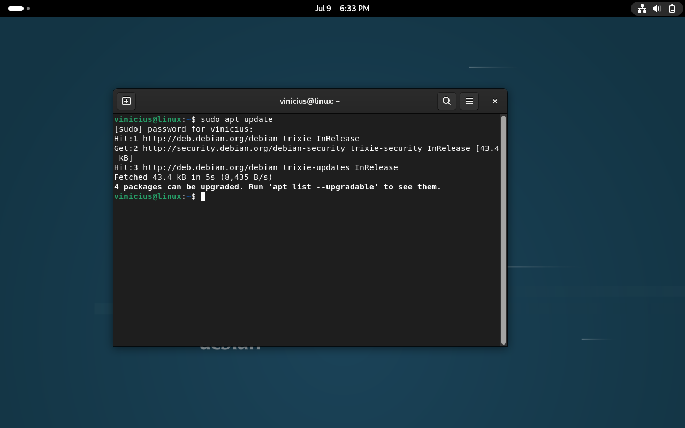
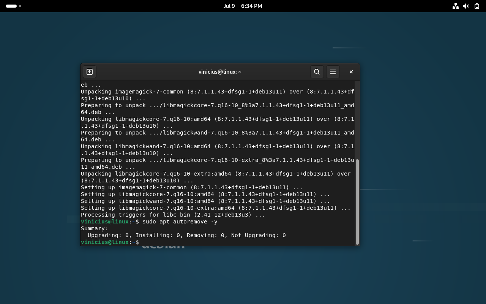
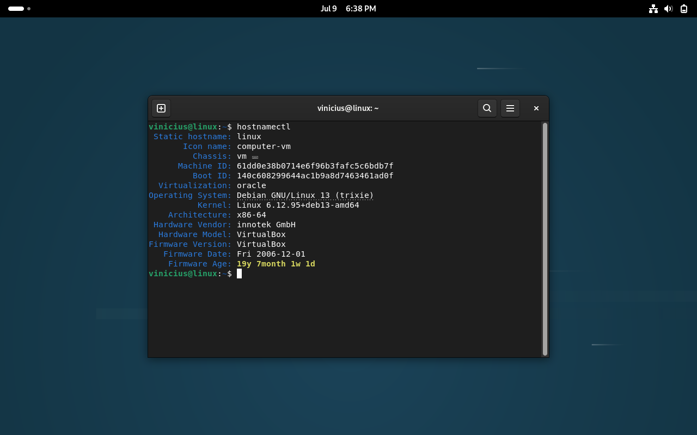

# Atualização do Debian

## Objetivo

Antes da instalação dos componentes do laboratório, foi realizada a atualização do sistema operacional para garantir que os pacotes instalados estivessem atualizados e o ambiente preparado para receber o Zabbix e o Grafana.

## Atualizando a lista de pacotes

Primeiramente, foi realizada a atualização da lista de pacotes disponíveis nos repositórios do Debian:

```bash
sudo apt update
```

Resultado da atualização:



## Atualizando os pacotes instalados

Após atualizar a lista de pacotes, foi realizada a atualização dos pacotes existentes no sistema:

```bash
sudo apt full-upgrade -y
```

Resultado da atualização:



## Removendo pacotes desnecessários

Após a atualização, foram removidos pacotes que não eram mais necessários:

```bash
sudo apt autoremove -y
```

## Reiniciando o servidor

Para aplicar as alterações realizadas durante a atualização, o servidor foi reiniciado:

```bash
sudo reboot
```

## Verificando informações do sistema

Após a reinicialização, foram verificadas as informações do sistema utilizando o comando:

```bash
hostnamectl
```

O comando apresenta informações como:

- Nome do host;
- Sistema operacional;
- Versão do kernel;
- Arquitetura;
- Ambiente de virtualização.

Resultado da verificação:



## Configuração da rede

Como o laboratório foi executado em uma máquina virtual utilizando VirtualBox, a interface de rede foi configurada como **Bridge Adapter**.

Essa configuração permite que a máquina virtual receba um endereço IP da mesma rede do ambiente, facilitando o acesso aos serviços disponibilizados pelo servidor, como o Frontend Web do Zabbix e o Grafana.

## Conclusão

Após a atualização do Debian e a validação das informações do sistema, a máquina virtual estava preparada para iniciar a instalação dos componentes do laboratório de monitoramento.