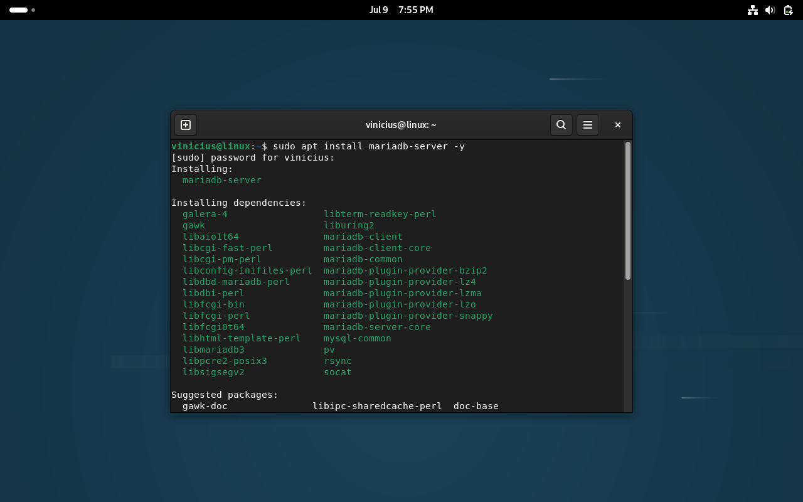
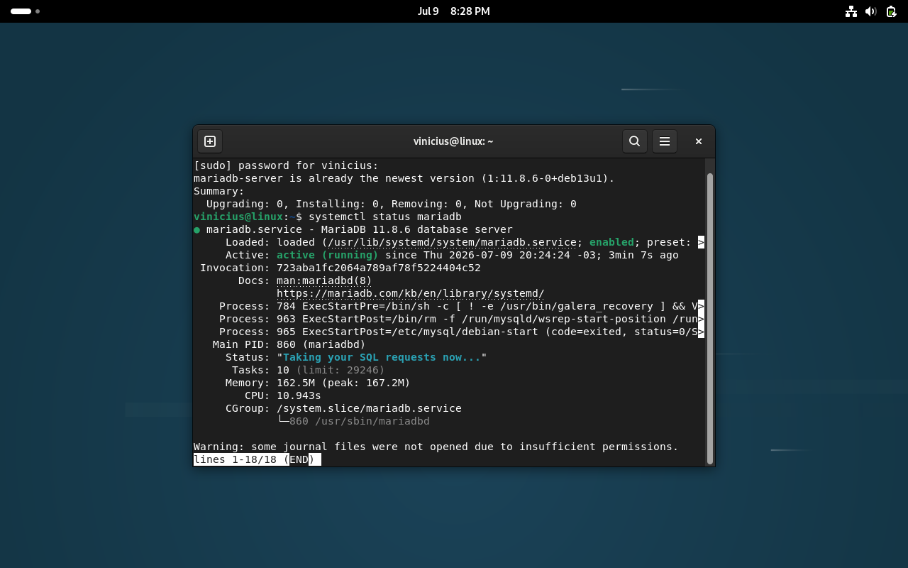
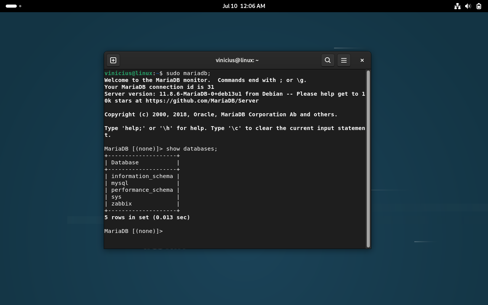

# Instalação do MariaDB

## Objetivo

O MariaDB foi utilizado como sistema de gerenciamento de banco de dados para armazenar as informações utilizadas pelo Zabbix.

## Instalando o MariaDB

Instale o servidor MariaDB utilizando o gerenciador de pacotes do Debian:

```bash
sudo apt install mariadb-server -y
```

Resultado da instalação:



## Verificando o serviço

Após a instalação, verifique se o serviço foi iniciado corretamente:

```bash
sudo systemctl status mariadb
```

Resultado esperado:

```text
Active: active (running)
```

Status do serviço:



## Configuração inicial

Para aplicar as configurações básicas de segurança do MariaDB, execute:

```bash
sudo mariadb-secure-installation
```

Durante a configuração foram realizadas as seguintes alterações:

- Ativação da autenticação utilizando `unix_socket`;
- Definição da senha do usuário `root`;
- Desativação do acesso remoto do usuário `root`;
- Remoção de usuários anônimos;
- Remoção do banco de dados de teste;
- Recarregamento das tabelas de permissões.

Como este laboratório utiliza apenas acesso local, o acesso remoto permaneceu desabilitado.

## Acessando o MariaDB

Após concluir a configuração inicial, acesse o console do MariaDB:

```bash
sudo mariadb
```

## Criando o banco de dados do Zabbix

Crie o banco de dados que será utilizado pelo Zabbix:

```sql
CREATE DATABASE zabbix
CHARACTER SET utf8mb4
COLLATE utf8mb4_bin;
```

Resultado esperado:

```text
Query OK, 1 row affected
```

## Criando o usuário do Zabbix

Crie um usuário dedicado para acessar o banco de dados:

```sql
CREATE USER 'zabbix'@'localhost' IDENTIFIED BY 'escolhaumasenhaforte';
```

Conceda as permissões necessárias:

```sql
GRANT ALL PRIVILEGES ON zabbix.* TO 'zabbix'@'localhost';
```

Aplique as alterações:

```sql
FLUSH PRIVILEGES;
```

## Verificando a criação do banco

Confirme que o banco de dados foi criado corretamente:

```sql
SHOW DATABASES;
```

O banco `zabbix` deverá aparecer entre os bancos disponíveis.

Resultado da criação do banco:



## Conclusão

Com o MariaDB configurado e o banco de dados do Zabbix criado, o ambiente estava preparado para a instalação do Zabbix Server e seus componentes.