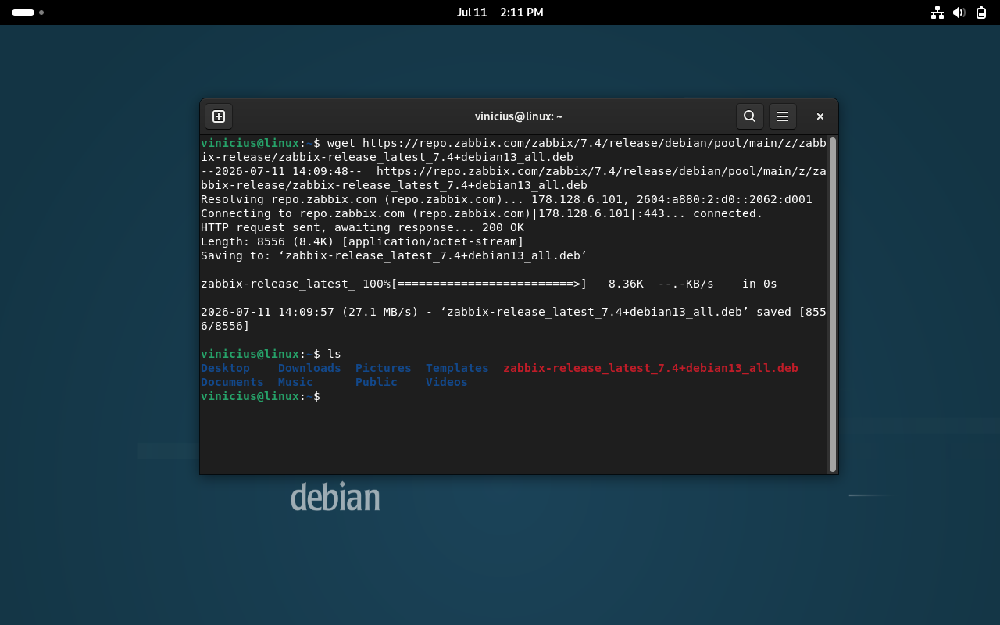
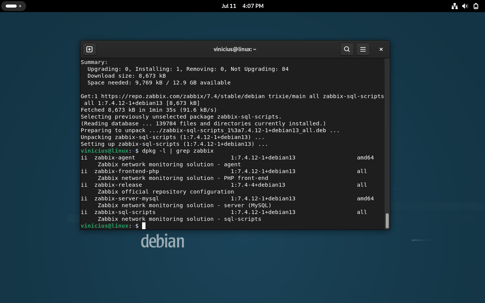

# Instalação do Zabbix

## Objetivo

Nesta etapa foi realizada a instalação do repositório oficial do Zabbix e dos componentes necessários para a implantação da plataforma de monitoramento.

## Verificando a versão do Debian

Antes da instalação, confirme a versão do sistema operacional:

```bash
cat /etc/os-release
```

Resultado esperado:

```text
Debian GNU/Linux 13 (Trixie)
```

## Adicionando o repositório oficial do Zabbix

Baixe o pacote do repositório oficial:

```bash
wget https://repo.zabbix.com/zabbix/7.4/release/debian/pool/main/z/zabbix-release/release_latest_7.4+debian13_all.deb
```

Verifique se o download foi realizado corretamente:

```bash
ls
```

Instale o pacote do repositório:

```bash
sudo dpkg -i zabbix-release_latest_7.4+debian13_all.deb
```

Atualize a lista de pacotes:

```bash
sudo apt update
```

Resultado da configuração do repositório:



## Instalando os componentes do Zabbix

Instale os pacotes necessários:

```bash
sudo apt install zabbix-server-mysql \
zabbix-agent \
zabbix-frontend-php \
zabbix-apache-conf \
zabbix-sql-scripts \
apache2 \
php \
php-mysql \
-y
```

Foram instalados os seguintes componentes:

- Zabbix Server;
- Zabbix Agent;
- Frontend Web do Zabbix;
- Configuração do Apache para o Frontend;
- Scripts SQL do Zabbix;
- Apache2;
- PHP;
- Driver PHP para MySQL.

Resultado da instalação:



## Arquivo de configuração do Apache

Durante a instalação, o pacote `zabbix-apache-conf` cria automaticamente o arquivo de configuração utilizado pelo Apache para disponibilizar o Frontend Web do Zabbix.

Arquivo criado:

```text
/etc/zabbix/apache.conf
```

Após a instalação, reinicie o serviço do Apache:

```bash
sudo systemctl restart apache2
```

## Localizando o script SQL

Localize o arquivo responsável pela criação da estrutura do banco de dados:

```bash
dpkg -L zabbix-sql-scripts | grep server.sql
```

Resultado esperado:

```text
/usr/share/zabbix/sql-scripts/mysql/server.sql.gz
```

## Importando o banco de dados

Importe a estrutura inicial do banco do Zabbix:

```bash
zcat /usr/share/zabbix/sql-scripts/mysql/server.sql.gz | mysql --default-character-set=utf8mb4 -uzabbix -p zabbix
```

Quando solicitado, informe a senha do usuário `zabbix` criada durante a configuração do MariaDB.

A importação cria todas as tabelas necessárias para o funcionamento do Zabbix.

## Conclusão

Com a instalação concluída e a estrutura do banco de dados importada, o ambiente estava preparado para a configuração do Zabbix Server e a finalização da instalação pelo Frontend Web.