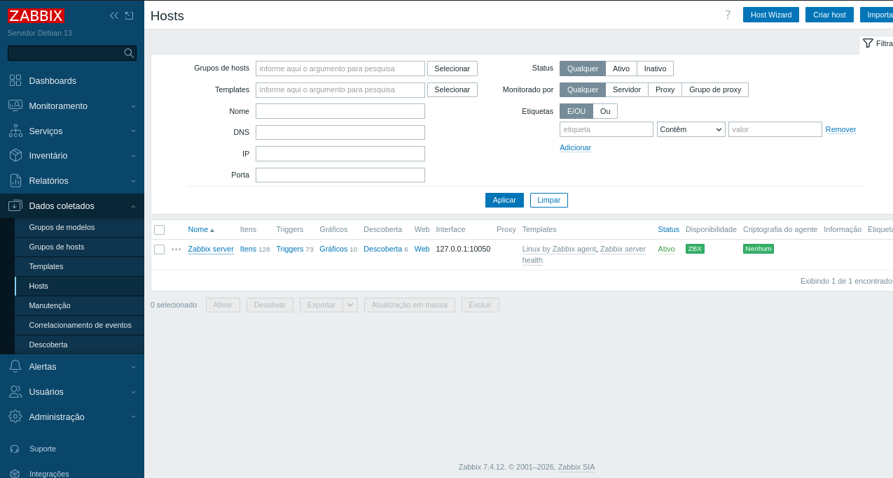
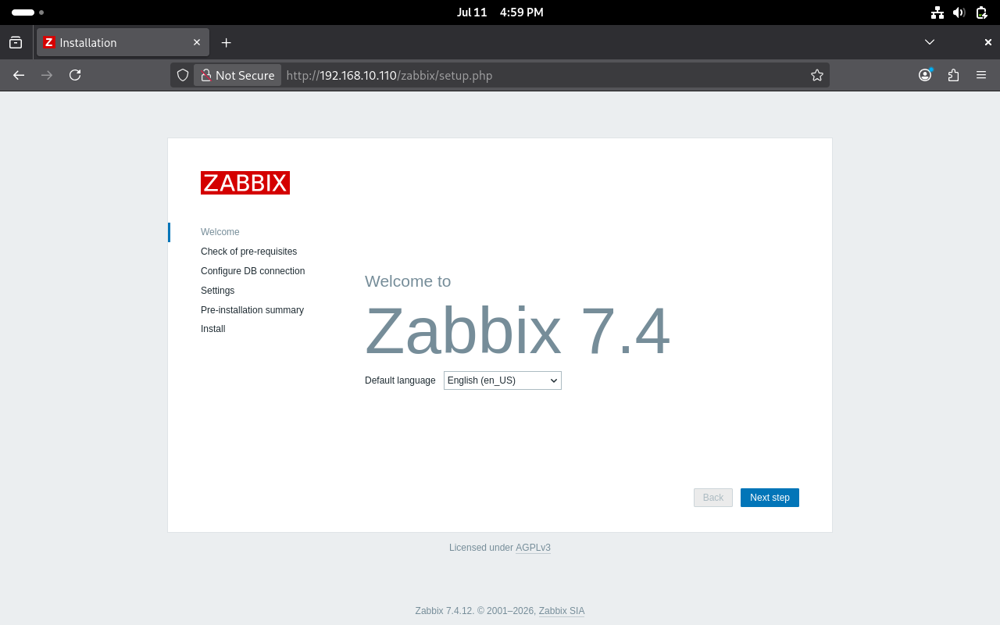

# Configuração do Zabbix

## Objetivo

Após a instalação dos componentes e da importação da estrutura do banco de dados, foi realizada a configuração do Zabbix Server, a inicialização dos serviços e a conclusão da instalação por meio do Frontend Web.

## Configurando o Zabbix Server

Edite o arquivo de configuração do Zabbix Server:

```bash
sudo nano /etc/zabbix/zabbix_server.conf
```

Localize o parâmetro:

```text
DBPassword=
```

Informe a senha criada para o usuário `zabbix` durante a configuração do MariaDB.

Exemplo:

```text
DBPassword=escolhaumasenhaforte
```

Salve o arquivo após realizar a alteração.

## Inicializando os serviços

Inicie os serviços necessários para o funcionamento do ambiente.

MariaDB:

```bash
sudo systemctl restart mariadb
```

Zabbix Server:

```bash
sudo systemctl start zabbix-server
```

Zabbix Agent:

```bash
sudo systemctl start zabbix-agent
```

Apache2:

```bash
sudo systemctl start apache2
```

## Habilitando a inicialização automática

Configure os serviços para iniciarem automaticamente durante a inicialização do sistema.

```bash
sudo systemctl enable mariadb
sudo systemctl enable zabbix-server
sudo systemctl enable zabbix-agent
sudo systemctl enable apache2
```

## Verificando os serviços

Confirme que os serviços estão em execução.

Zabbix Server:

```bash
sudo systemctl status zabbix-server
```

Zabbix Agent:

```bash
sudo systemctl status zabbix-agent
```

Apache2:

```bash
sudo systemctl status apache2
```

Resultado esperado:

```text
Active: active (running)
```

Status do serviço do Zabbix Server:



## Acessando o Frontend Web

Com todos os serviços iniciados, acesse o Frontend Web utilizando um navegador.

```text
http://192.168.10.110/zabbix
```

Substitua o endereço IP pelo configurado no seu ambiente.

Na tela inicial do assistente de instalação, clique em **Next step** para iniciar a configuração.

Durante a instalação serão realizadas as seguintes etapas:

- Verificação dos pré-requisitos do ambiente;
- Configuração da conexão com o banco de dados;
- Configuração do servidor Zabbix;
- Revisão das configurações;
- Conclusão da instalação.

Tela inicial do Frontend Web:



## Primeiro acesso

Após concluir a instalação, será apresentada a tela de autenticação do Zabbix.

Credenciais padrão:

**Usuário**

```text
Admin
```

**Senha**

```text
zabbix
```

Após o primeiro acesso, recomenda-se alterar a senha do usuário `Admin`.

## Próxima etapa

Com o Zabbix configurado e em funcionamento, a próxima etapa consiste na instalação do Grafana e na integração entre as duas ferramentas para criação dos dashboards de monitoramento.